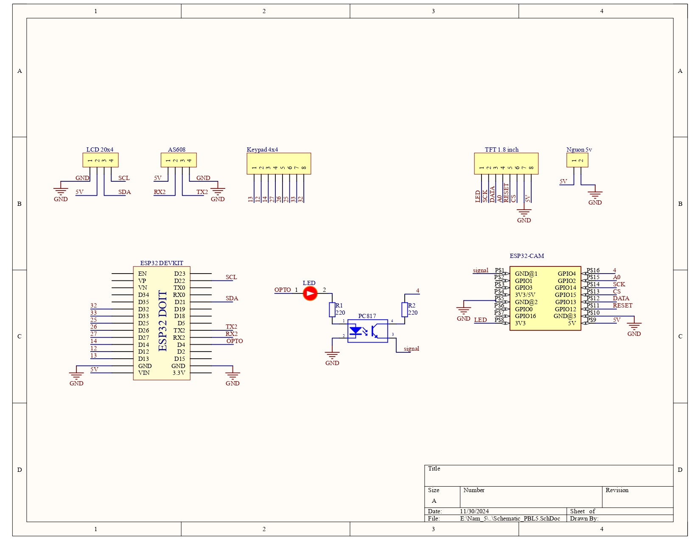
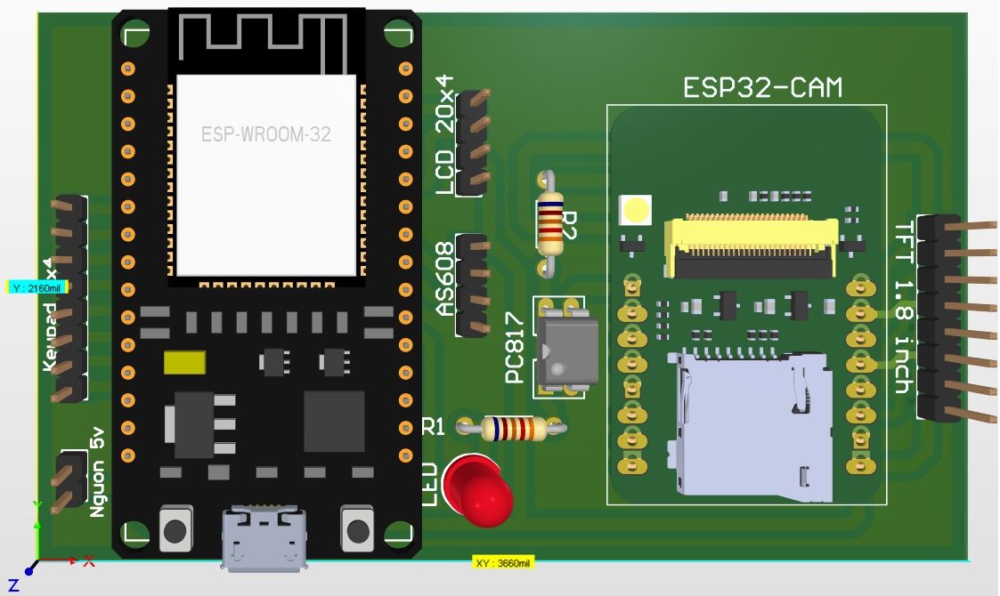
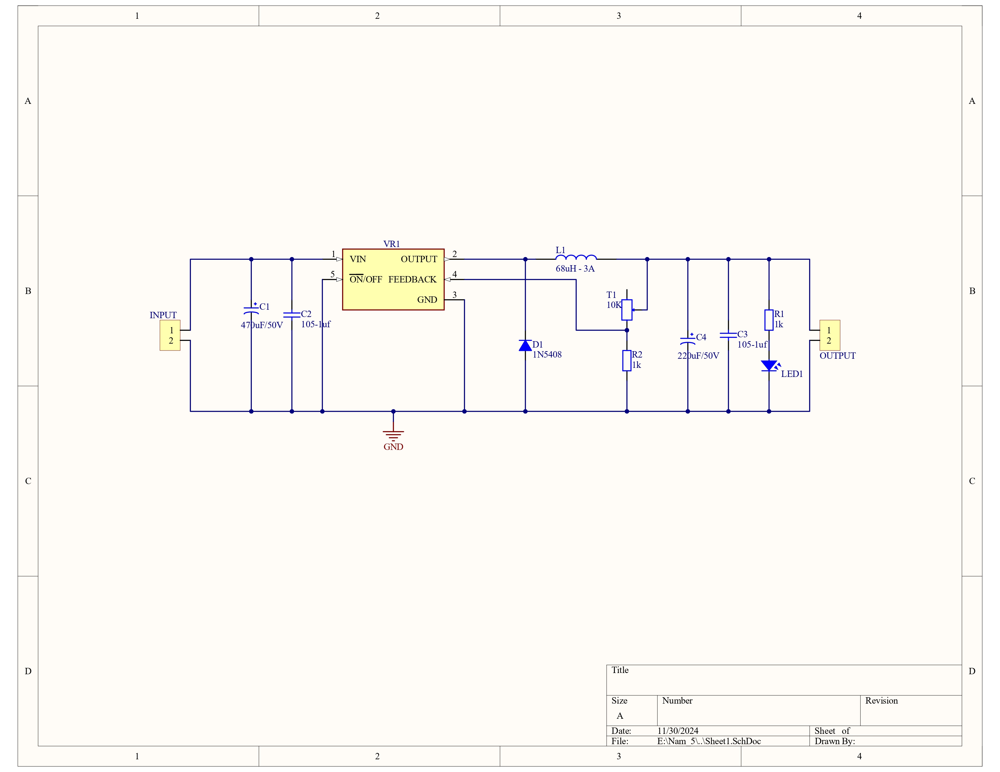
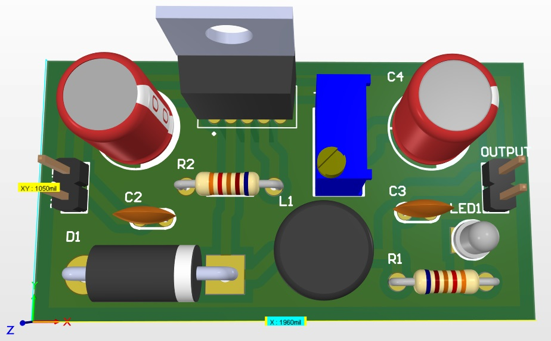

12:42 PM 11/20/2024
## Mô hình chấm công nhân viên sử dụng Vân tay và Khuôn mặt - MCU ESP32 và ESP32CAM
### 1. Sơ đồ phần cứng gồm: 
- MCU ESP32, ESP32Cam - AI Thinker
- Sensor AS608
- LCD 20x04
- Keypad 4x4
- TFT LCD 1.8 inch
- Opto PC817, Resistor, LED,...

### 2. Mạch chính

  
  

### 3. Mạch nguồn

  
  

### 4. Nguyên lý hoạt động
- Chức năng thêm nhân viên: Thêm vân tay thành công -> ESP32 gửi tín hiệu điều khiển qua PC817 -> ESP32CAM nhận tín hiệu điều khiển và bật khung camera của ESP32CAM để thêm khuôn mặt -> Tắt Camera
- Chức năng chấm công nhân viên: Quét vân tay thành công -> ESP32 gửi tín hiệu điều khiển qua PC817 -> ESP32CAM nhận tín hiệu điều khiển và bật khung camera của ESP32CAM để quét khuôn mặt -> Chấm công thành công -> Gửi thông tin chấm công (tên, trạng thái, thời gian) lên Web server -> Tắt Camera
